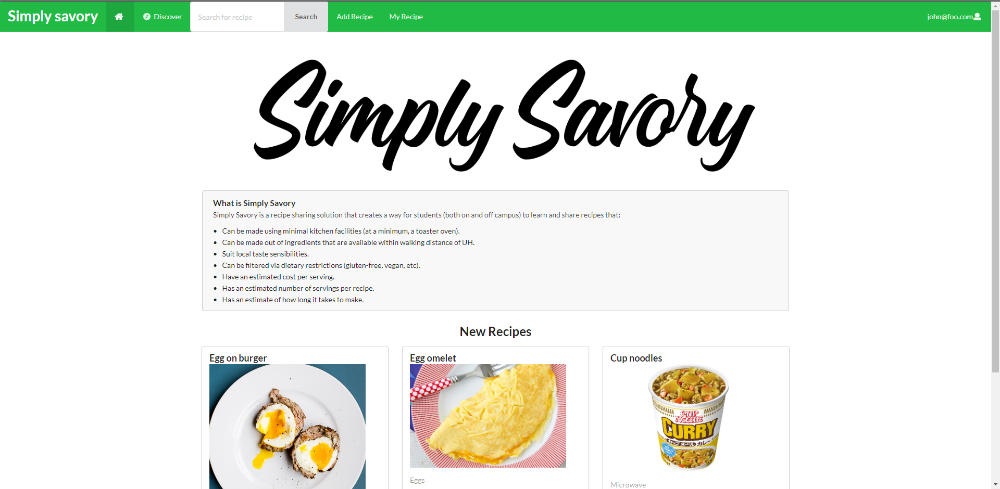

 

# Table of Contents
<ul>
 <li><a href="#overview">Overview</a></li>
  <li><a href="#user-guide">User Guide</a></li>
 <li><a href="#community-feedback">Community Feedback</a></li>
 <li><a href="#developer-guide">Developer Guide</a></li>
 <li><a href="#links">Links</a> </li>
 <li><a href="#dev-history">Development History</a></li>
 <li><a href="#team">The Team</a> </li>
 </ul>
  
 
<h1 id="#overview">Overview</h1>
Simply Savory is a web application that provides a centralized site for UH Manoa students to learn and share affordable recipes that can be prepared with minimal kitchen facilities (both on and off campus) to suit local taste sensibilities. Users will be able to browse posted recipes, search and filter by specific ingredients, and save recipes to their personal "cookbook". Recipes will have additional information that is useful for students on a budget, such as price per serving, and ingredient sales at nearby supermarkets. 

<h1 id="#user-guide">User-Guide</h1>
Simply Savory has many different pages to help serve the UH community, this section provides a walkthrough of the user interface and its capabilities.

 <h3>Landing</h3>
 
 This<a href="http://simply-savory.meteorapp.com/#/"> page </a>is what users will see when initially visitng the site, it explains the purpose of simply savory, and shows some popular recipes.
 
 <h3>User Home Page (Your Recipes)</h3>
 
This<a href="http://simply-savory.meteorapp.com/#/myrecipe"> page </a> is the user's "recipe book" containg recipes that they have posted, along with recipes from other users that they have saved.
 
 <h3>Account Creation/Sign In</h3>
  
 This<a href="http://simply-savory.meteorapp.com/#/signup"> page </a> is where the user can sign in, or create an account to start sharing recipes.
  
 <h3>Add Recipes</h3>
  
  This<a href="http://simply-savory.meteorapp.com/#/add"> page </a> is the interface for adding recipes, allowing the user to input various paramters such as ingredients directions, and an image of the finished dish.
  
 <h3>Discover New Recipes</h3> 
 
 This<a href="http://simply-savory.meteorapp.com/#/Discover"> page </a> is where recently listed recipes are displayed along with the most popular recipes (rated by other users).
 
 <h3>Search Recipes </h3>
 
  This<a href="http://simply-savory.meteorapp.com/#/Search"> page </a> shows the results of a user search, filtering all recipes on the database using meta tags like "egg".
 
 <h3>Individual Recipes Page</h3>
   
   This<a href="http://simply-savory.meteorapp.com/#/Recipe"> page </a> displays information about a single recipe, and is accessed by clicking on a recipe card on any page that it appears. 
 
<h1 id="#community-feedback">Community Feedback</h1>
This section will be updated after Milestone 2, when testing is done with UH students to gather feedback for further improvements & revisions.

<h1 id="#developer-guide">Developer Guide</h1>

<h1 id="dev-history">Development History</h1>
 <h3> Milestone 1</h3>
 In Milestone 1, the following tasks were accomplished:
 <ul>
 <li>Mockups for all 8 pages</li>
 <li>Galaxy Deployment </li>
 <li>Github.io initial creation </li>
 <li>Navbar created & search bar </li>
 <li>App routing & linking </li>
 </ul>
 <h3> Milestone 2 </h3>
 In Milestone 2, the following tasks were accomplished:
  <ul>
 <li>Database setup</li>
 <li>Cards updating from sample data</li>
 <li>Search based on meta info</li>
 <li>Input method to database via forms</li>
 <li>Account mapping to cards</li>
 </ul>
 
<h1 id="#links">Links</h1>
<ul>
  <li><a href="https://github.com/simply-savory">Simply Savory Organization Page</a></li>
  <li><a href="http://simply-savory.meteorapp.com/#/">Deployment on Galaxy</a></li>
  <li><a href="https://github.com/simply-savory/simply-savory/projects/1">Milestone 1</a></li>
  <li><a href="https://github.com/simply-savory/simply-savory/projects/2">Milestone 2</a></li>
</ul>

<h1 id="#team">The Team </h1>
<ul>
 <li><a href="https://aujared.github.io/">Jared Au</a> </li>
 <li><a href="https://nchu277.github.io/">Nate Chu</a> </li> 
 <li><a href="https://tosuzu1.github.io/">Felix Hong</a> </li> 
 <li><a href="https://kade-shiro.github.io/">Kade Shiroma</a> </li> 
 </ul>
