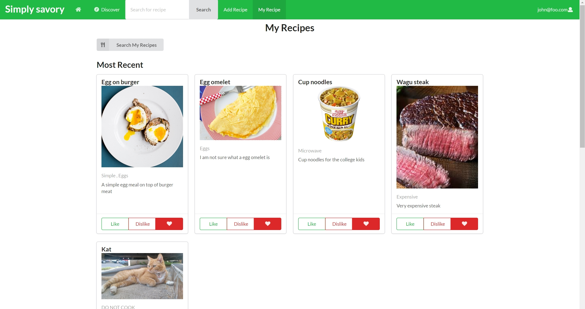
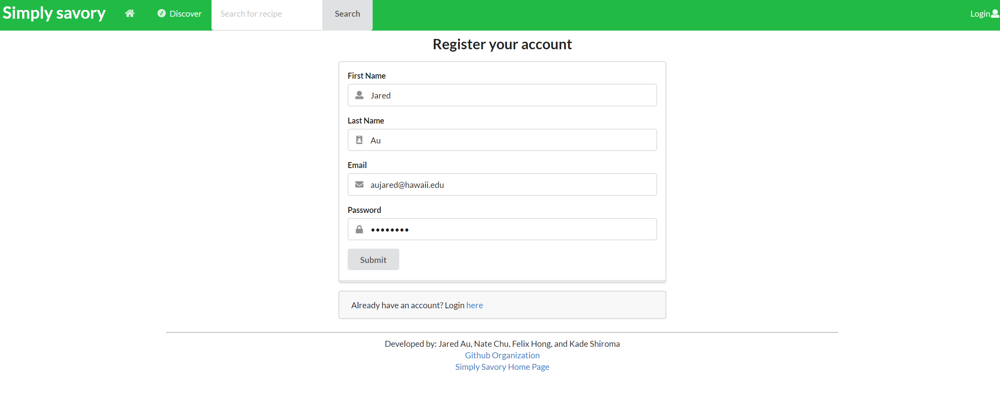
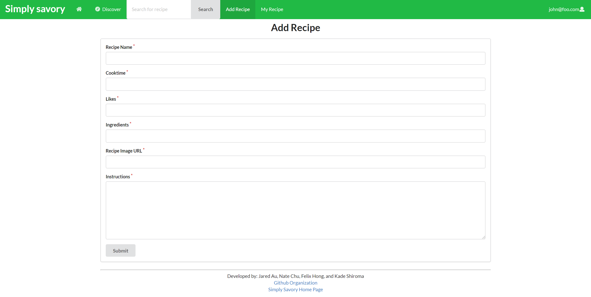
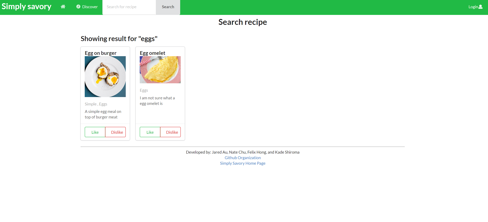
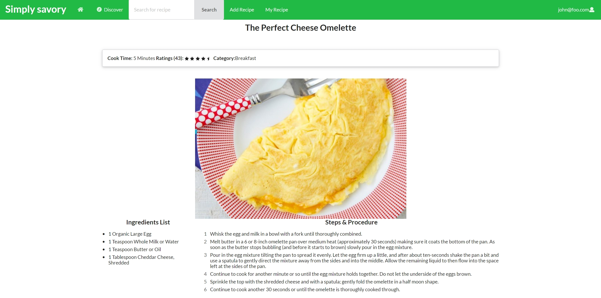

## Important Links
### Milestone 1 Project Board
[Click Here](https://github.com/simply-savory/simply-savory/projects/1)
### Milestone 2 Project Board
[Click Here](https://github.com/simply-savory/simply-savory/projects/2)
## Galaxy Deployment
[Click Here](https://galaxy.meteor.com/app/simply-savory.meteorapp.com)
## The Team
### Jared Au 

Background/Current Skills

Computer Engineering Major
<ul>
 <li>C++ </li>
 <li>Javascript </li>
 <li>Project Management </li>
</ul>
Looking to improve on:
<ul>
 <li>Database Management </li>
 <li>UI Design </li>
</ul>

### Nate Chu 

Background/Current Skills

Computer Engineering Major
<ul>
 <li>JavaScript</li>
 <li>C and C++</li>
</ul>
Looking to improve on:
<ul>
 <li>Project Management Skills</li>
 <li>Teamwork</li>
 <li>Web Design</li>
</ul>

### Felix Hong 

Background/Current Skills

Computer Engineering Major
<ul>
 <li>Javascript</li>
 <li>C and C++</li>
 <li>Python</li>
 <li>Verilog</li>
</ul>
Looking to improve on:
<ul>
 <li>C++ (advanced)</li>
 <li>Javasciprt/webdev</li>
 <li>Git</li>
</ul>

### Kade Shiroma 

Background/Current Skills

Computer Science Major
<ul>
 <li>Java</li>
 <li>Javascript</li>
 <li>C and C++</li>
</ul>
Looking to improve on:
<ul>
 <li>Algorithms</li>
 <li>Teamwork</li>
 <li>Web Development</li>
</ul>

## The Problem 

Many college students have limited kitchen resources, limited cooking skills, limited time, limited access to grocery stores, and no access to creative recipes that respect these constraints. As a result, college students spend money to eat out, or eat non-healthy foods at fast food places or through vending machines.

## The Solution

Simply Savory is a recipe sharing solution that creates a way for students (both on and off campus) to learn and share recipes that:
<ul>
 <li>Can be made using minimal kitchen facilities (at a minimum, a toaster oven). </li>
 <li>Can be made out of ingredients that are available within walking distance of UH. </li>
 <li>Suit local taste sensibilities. </li>
 <li>Can be filtered via dietary restrictions (gluten-free, vegan, etc). </li>
 <li>Have an estimated cost per serving. </li>
 <li>Has an estimated number of servings per recipe. </li>
 <li>Has an estimate of how long it takes to make. </li>
 </ul>

## Project Specs
<ul>
 <li>Users will be able to create an account or log in with their UH Info (theoretically). </li>
  <li>Users can post a recipe, including its ingredients, directions, cooktime and other meta info </li>
  <li>Ability to "Save" recipes from other to your own recipe book for later viewing</li>
  <li>Rate recipes or leave feedback if you tried them </li>
  <li>Search for a recipe by ingredient, ie. I want to make something with these eggs </li>
  <li>Filter by recipe rating or numerous other categories</li>
  <li> Privledges for Admins & Recipe creators to make edits or remove recipes</li>
 
 </ul>

## Mockup Pages 
<ul> 
 <li><b>Landing</b></li>
 Link:<a href="http://simply-savory.meteorapp.com/#/">Click Here</a>
 
 
 <li><b>User Home Page (Your Recipes)</b></li>
 Link:<a href="http://simply-savory.meteorapp.com/#/myrecipe">Click Here</a>
 
 
 <li><b>Account Creation/Sign In</b> </li>
 Link:<a href="http://simply-savory.meteorapp.com/#/signup">Click Here</a>
  
  
 <li><b>Add Recipes</b></li>
 Link:<a href="http://simply-savory.meteorapp.com/#/add">Click Here</a>
  
  
 <li><b>Discover New Recipes</b> </li> 
 Link:<a href="http://simply-savory.meteorapp.com/#/Discover">Click Here</a>
 
 
 <li><b>Search Recipes</b> </li>
 Link:<a href="http://simply-savory.meteorapp.com/#/Search">Click Here</a>
 
 
 <li><b>Individual Recipes Page</b> </li>
 Link:<a href="http://simply-savory.meteorapp.com/#/Recipe">Click Here</a>
   
</ul>
