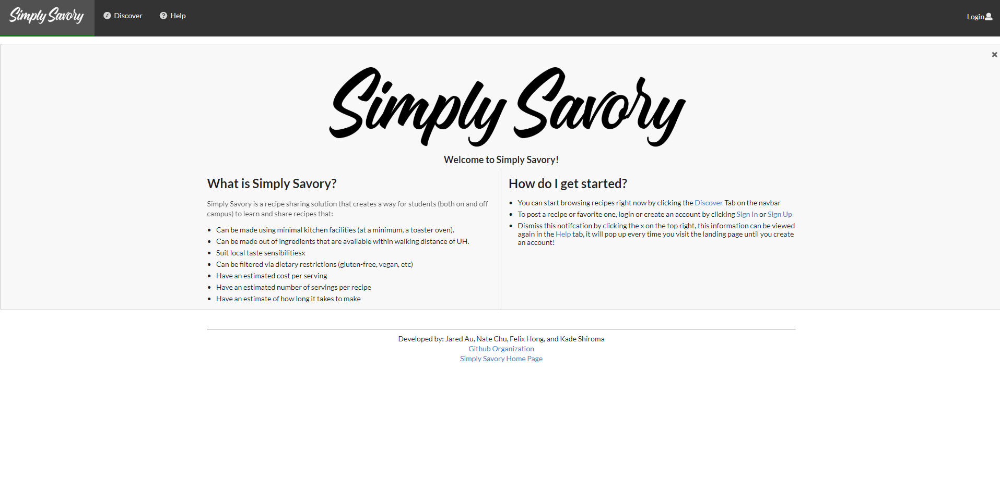
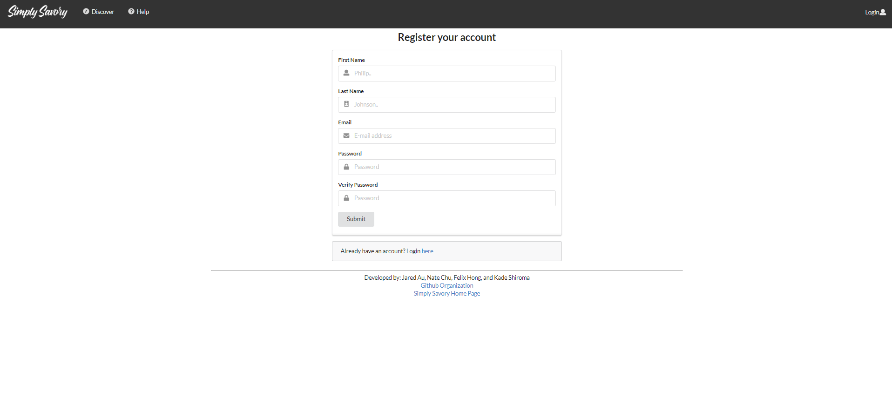
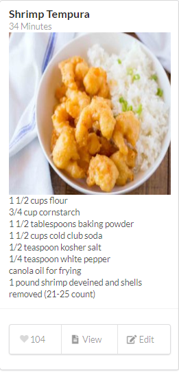
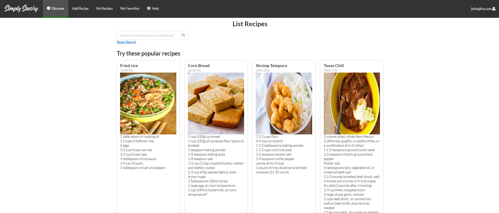
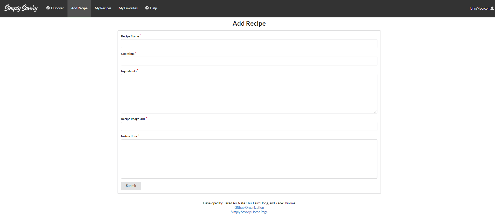
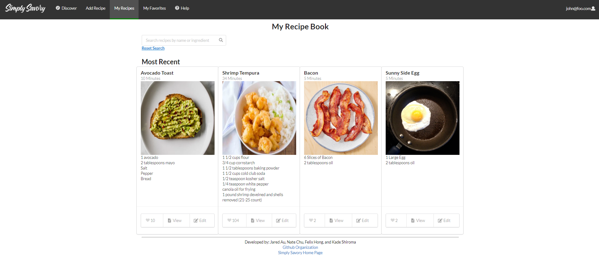
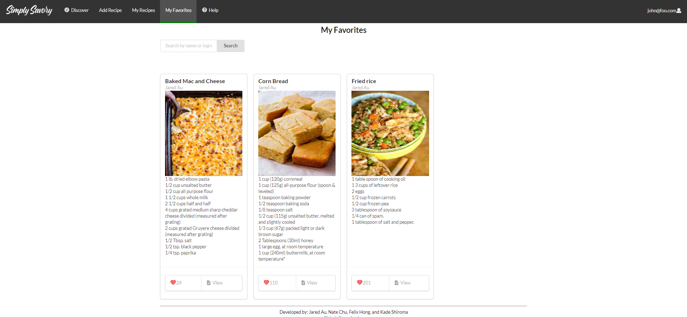
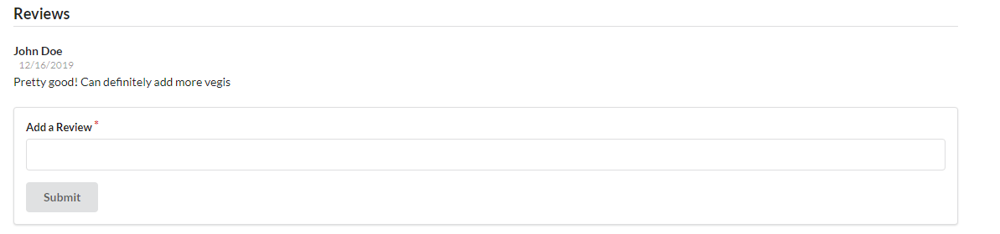

 

# Table of Contents
<ul>
 <li><a href="#overview">Overview</a></li>
  <li><a href="#user-guide">User Guide</a></li>
 <li><a href="#community-feedback">Community Feedback</a></li>
  <li><a href="#challenges">Challenges</a></li>
 <li><a href="#developer-guide">Developer Guide</a></li>
 <li><a href="#links">Links</a> </li>
 <li><a href="#dev-history">Development History</a></li>
 <li><a href="#team">The Team</a> </li>
 </ul>
  
 
<h1 id="overview">Overview</h1>
Simply Savory is a web application that provides a centralized site for UH Manoa students to learn and share affordable recipes that can be prepared with minimal kitchen facilities (both on and off campus) to suit local taste sensibilities. Users will be able to browse posted recipes, search and filter by specific ingredients, and save recipes to their personal "cookbook". Recipes will have additional information that is useful for students on a budget, such as price per serving, and ingredient sales at nearby supermarkets. 

<h1 id="user-guide">User-Guide</h1>
Simply Savory has many different pages to help serve the UH community, this section provides a walkthrough of the user interface and its capabilities.

 <h3>Landing</h3>
 
 When you first visit the site, you are taken here to the landing page. It provides an introduction about what simply savory is, and how to get started with registering an account and posting recipes. While not signed in, you will only be able to access the discover recipes tab, help tab, and be able to sign up for a new account or log in via the top right drop down.
  
  <h3>Account Creation/Sign In</h3>
  
 Clicking Sign-Up on the login dropdown will bring you to this page. Here you can enter some general information such as your email address, password, first name and last name. Users can also indicate if they are a vendor, meaning they would like to advertise deals on ingredients (this account type is still able to post & view recipes).
  
 <h3>The Recipe Card</h3>
 
 
 Here you can see the information displayed on a recipe card, this card is utilized on several pages, including "Discover Recipes" "My Recipes" and "My Favorites". The card provides a preview into the recipe that it pertains to, including title, author name, ingredients, and a picture. The bottom of the card has 2 buttons initially, a heart which likes and favorites the recipe, and view, which will open up the full recipe on a new page. If you are logged in, and are the poster of the recipe, you will have a edit button that opens up a page allowing you to change the recipe information.
 
 <h3>Discover Recipes</h3>
 
 The discover recipes page can be accessed via the navbar by all users regardless of whether or not they have an account. This page displays recipe cards, showing the newest recipes first, and has a search bar for users to filter recipes. The search bar will search both the title and ingredients list for the search keywords. After searching, the user can click reset serach criteria to return to the original display.

 <h3>Add Recipes</h3>
  
 The add recipes page is a form with a number of fields for the user to fill out, these will help us populate the recipe cards that provide a short preview of the recipe, as well as the recipe page which will include all of this information in-depth. The formatting of the instruction and ingredients fields will be preserved assuming that the user makes use of the line break character (pressing enter on the keyboard)

<h3>My Recipes</h3> 
 
 The My Recipes page displays all recipes that the user posts, if they have not made any posts yet, a message will be displayed saying "No Recipes Found". The same search bar from discover recipes is implemented here, allowing users to search recipes by ingredients
 
 <h3>My Favorites</h3>
 
 The My Favorites page will display any recipes that you have liked (clicked the heart), rendering the same card information that was displayed when you favorited it on the landing page or discover recipes. 
 
 <h3>Display Recipe</h3>
 
  This is the page that the user is brought to after clicking "View" on the bottom of any recipe card. As previously mentioned, these cards are rendered on Landing, Discover Recipes, My Recipes and My Favorites
 
 <h3> Reviews </h3>
 
 At the bottom of each recipe page, there is a feed displaying reviews left by users, showing the name of the user with the message.
 
<h1 id="community-feedback">Community Feedback</h1>
<h4>Kayli Chun: UH Manoa Mechanical Engineering Student</h4>

 Suggestions/Comments:
 <ul>
 <li>Add links to login/signup landing explaination </li>
 <li>General grammar editing on landing page, periods, apostrophes etc </li>
 <li>Verify password on account creation page </li>
 <li>Show a no recipes found message for empty search results </li>
 <li>Pop up to verify recipe deletion </li>
 </ul>
 
 <h4>Huy Nguyen: UH Manoa Electrical Engineering Student</h4>
 
 Suggestions/Comments:
 <ul>
 <li>Aspect ratio on preview thumbnails is a bit off </li>
 <li>Straight forward and easy to use </li>
 <li>Add bullet points to the cards for ingredients </li>
 </ul>
 
 <h4>Radford Leong: UH Manoa MIS Student</h4>
 
 Suggestions/Comments:
 <ul>
 <li>Add hyperlinks to things on the landing and help page </li>
 <li>More cards per row? Instead of just 3 </li>
 <li>Change My Recipe to My Recipes </li>
 <li>Need a page to edit account </li>
 <li>Change formatting of the Initial Help Page, looks weird to have all text left justified </li>
 <li>Return back to my recipe page after submitting an edit </li>
 </ul>
 
 <h4>Spencer Lau: UH Manoa Law Student</h4>
 
 Suggestions/Comments:
 <ul>
 <li>More vivid color scheme for navbar </li>
 <li>Add darker borders to cards to make them pop more </li>
 </ul>
 
 <h4>Carissa Nakao: UH Manoa Electircal Engineering Student </h4>
 
 Suggestions/Comments:
 <ul>
 <li>Cool sleek design </li>
 <li>Add ability to search more than one ingreidient </li>
 <li>Change formatting in tab to be Simply-Savory (capitalize second S) </li>
 </ul>

<h1 id="challenges">Challenges</h1>
Throughout the development of this project, we had to overcome many issues as seemingly simple features required a substantial amount of work to implement properly and to a high standard. We spent alot of time expanding far beyond the template "Add Stuff, List Stuff" pages, and made sure 

Halfway in between Milestone 2 and 3 we achieved what we considered to be a Milestone 3 level of functionality for Simply Savory, besides some small cosmetic changes & grammar errors that we recieved as feedback, we were mostly done. 

After this we decided to work on Vendors as an additional improvement, this proved to be much more difficult than we planned as we had designed the infrastructure of our project in a peculiar way. With all the inter-linking between recipes, accounts, cards and components we soon realized that implementing: A vendor account type, vendor page for posting deals, and displaying deals would be much more work than we anticipated. We would essentially need to redo most of our previous work as we encountered issues sharing account information between client and server.

We were able to get a working vendor implementation of having a vendor account type, a vendor page for posting deals, and displaying deals working only with default data, but it posed an issue when trying to create that account on the client side. This was due to a security risk where adding roles to account creation could only be done on the server side. The only solution we had to this issue would have been to redo how we handled a lot of the client data used for account creation.

In the end we came together as a group and discussed how to proceed. We ended up deciding not to include anything pertaining to Vendor, as we felt that it would detract from the quality of the rest of the project if we had a few pages and components that were not up to our standards. We had a draft for a vendor deals page that displayed posted deals in a table similar to "List Stuff", but this was certainly not Milestone 3 level, and due to time constraints we would not have enough time to bring all vendor components and pages up to a similar level of quality as the rest of the site.

<h1 id="developer-guide">Developer Guide</h1>
<h3 id="installation">Installation</h3>

The following steps will walk you through installing and running the application locally.

<ol>
  <li>
    
In order to begin using the application you will need to <a href="https://www.meteor.com/install"> install Meteor </a>

  </li>
  <li>
    
Next, you will need to <a href="https://github.com/simply-savory/simply-savory">download</a> a copy of Simply Savory to your local machine.
You may need to request permission from the authors in order to access the repo.

  </li>
  <li>Then, using a terminal or the command prompt you will need to navigate into the /app directory and install the Meteor library as follows:
    

   <code> meteor npm install </code>
 

  </li>
  <li>After Meteor has been installed, you can then run the application by using:
    

   <code>meteor npm run start</code>
 

  </li>
  <li>After the app runs for the first time, it will create some default data and users. The output should look as follows:
    

   
 

    

   There is a bcrypt warning, but we will not need it for our application
 

  </li>
  <li>If there are no errors, the template application will appear at <a href="http://localhost:3000/">http://localhost:3000/</a>. You can then login by using one of the default accounts at <a href="https://github.com/ics-software-engineering/meteor-application-template-react/blob/master/config/settings.development.json">settings.development.json</a> or create your own by .</li>
 <li>To make changes to the system or recommend features, please open a issue via github <a href="https://github.com/simply-savory/simply-savory/issues">here</a> and create your own branch with the name as "issue-xxx" where the xxx is replaced with the issue number</li>
 <li>If you have implemented a change that you believe should be included in the main project, please create a pull request where we will review the change and approve it after verification.</li>
</ol>

<h1 id="dev-history">Development History</h1>
<h3> Milestone 1</h3>
In Milestone 1, the following tasks were accomplished:
<ul>
 <li>Mockups for all 8 pages</li>
 <li>Galaxy Deployment </li>
 <li>Github.io initial creation </li>
 <li>Navbar created & search bar </li>
 <li>App routing & linking </li>
</ul>
<h3> Milestone 2 </h3>
In Milestone 2, the following tasks were accomplished:
<ul>
 <li>Github.io Redesign</li>
 <li>Database setup</li>
 <li>Cards updating from sample data</li>
 <li>Search based on meta info</li>
 <li>Input method to database via forms</li>
 <li>Account mapping to cards</li>
 <li>Like button functionality</li>
 <li>Card Formatting & Front End Design</li>
 </ul>
<h3> Milestone 3 </h3>
In Milestone 3, the following tasks were accomplished:
<ul>
 <li>Completed Github.io page</li>
 <li>Likes & Favoriting System implemented</li>
 <li>Editing Recipes</li>
 <li>Displaying User First & Last Name on Reviews & Recipes</li>
 <li>Improved Search & Filter Functions </li>
 <li>Created more publications for different login statuses </li>
 <li>Implemented suggestions from community feedback </li>
 <li>Expanded sample data</li>
</ul>
 
<h1 id="links">Links</h1>
<ul>
 <li><a href="https://github.com/simply-savory">Simply Savory Organization Page</a></li>
 <li><a href="http://simply-savory.meteorapp.com/#/">Deployment on Galaxy</a></li>
 <li><a href="https://github.com/simply-savory/simply-savory/projects/1">Milestone 1</a></li>
 <li><a href="https://github.com/simply-savory/simply-savory/projects/2">Milestone 2</a></li>
 <li><a href="https://github.com/simply-savory/simply-savory/projects/3">Milestone 3</a></li>
</ul>

<h1 id="team">The Team </h1>
<ul>
 <li><a href="https://aujared.github.io/">Jared Au</a> </li>
 <li><a href="https://nchu277.github.io/">Nate Chu</a> </li> 
 <li><a href="https://tosuzu1.github.io/">Felix Hong</a> </li> 
 <li><a href="https://kade-shiro.github.io/">Kade Shiroma</a> </li> 
</ul>
