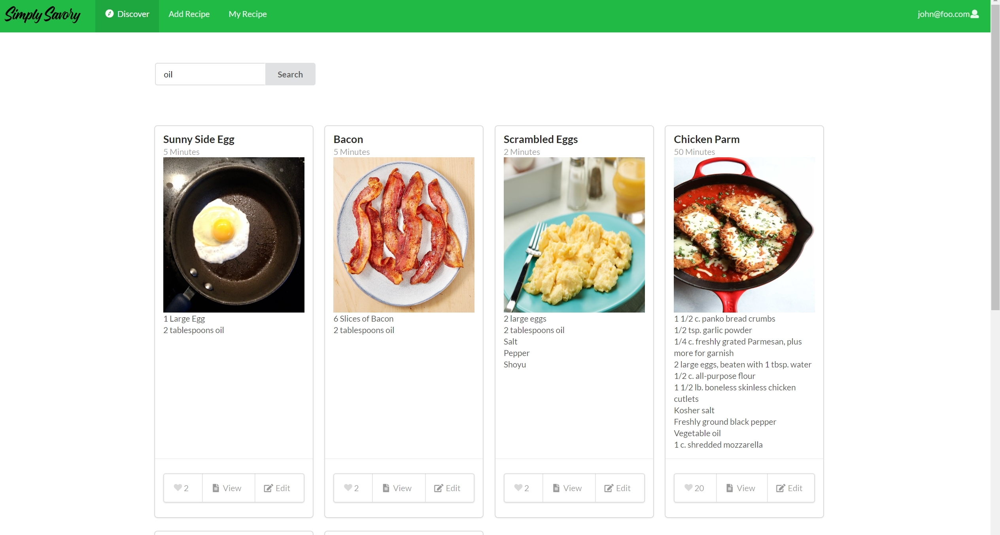

 

# Table of Contents
<ul>
 <li><a href="#overview">Overview</a></li>
  <li><a href="#user-guide">User Guide</a></li>
 <li><a href="#community-feedback">Community Feedback</a></li>
 <li><a href="#developer-guide">Developer Guide</a></li>
 <li><a href="#links">Links</a> </li>
 <li><a href="#dev-history">Development History</a></li>
 <li><a href="#team">The Team</a> </li>
 </ul>
  
 
<h1 id="overview">Overview</h1>
Simply Savory is a web application that provides a centralized site for UH Manoa students to learn and share affordable recipes that can be prepared with minimal kitchen facilities (both on and off campus) to suit local taste sensibilities. Users will be able to browse posted recipes, search and filter by specific ingredients, and save recipes to their personal "cookbook". Recipes will have additional information that is useful for students on a budget, such as price per serving, and ingredient sales at nearby supermarkets. 

<h1 id="user-guide">User-Guide</h1>
Simply Savory has many different pages to help serve the UH community, this section provides a walkthrough of the user interface and its capabilities.

 <h3>Landing</h3>
 
 This<a href="http://simply-savory.meteorapp.com/#/"> page </a>is what users will see when initially visitng the site, it explains the purpose of simply savory, and shows some popular recipes.
 
 <h3>User Home Page (Your Recipes)</h3>
 
This<a href="http://simply-savory.meteorapp.com/#/myrecipe"> page </a> is the user's "recipe book" containg recipes that they have posted, along with recipes from other users that they have saved.
 
 <h3>Account Creation/Sign In</h3>
  
 This<a href="http://simply-savory.meteorapp.com/#/signup"> page </a> is where the user can sign in, or create an account to start sharing recipes.
  
 <h3>Add Recipes</h3>
  
  This<a href="http://simply-savory.meteorapp.com/#/add"> page </a> is the interface for adding recipes, allowing the user to input various paramters such as ingredients directions, and an image of the finished dish.
  
 <h3>Discover New Recipes</h3> 
 
 This<a href="http://simply-savory.meteorapp.com/#/Discover"> page </a> is where recently listed recipes are displayed along with the most popular recipes (rated by other users).
 
 <h3>Search Recipes </h3>
 
  This<a href="http://simply-savory.meteorapp.com/#/Search"> page </a> shows the results of a user search, filtering all recipes on the database using meta tags like "oil".
 
 <h3>Individual Recipes Page</h3>
   
   This<a href="http://simply-savory.meteorapp.com/#/Recipe"> page </a> displays information about a single recipe, and is accessed by clicking on a recipe card on any page that it appears. 
 
<h1 id="community-feedback">Community Feedback</h1>
<b>Kayli Chun: UH Manoa Mechanical Engineering Student</b>
 Suggestions/Comments:
 <ul>
 <li>Add links to login/signup landing explaination </li>
 <li>General grammar editing on landing page, periods, apostrophes etc </li>
 <li>Verify password on account creation page </li>
 <li>Show a no recipes found message for empty search results </li>
 <li>Pop up to verify recipe deletion </li>
 </ul>
 
 <b>Huy Nguyen: UH Manoa Electrical Engineering Student</b>
 Suggestions/Comments:
 <ul>
 <li>Aspect ratio on preview thumbnails is a bit off </li>
 <li>Straight forward and easy to use </li>
 <li>Add bullet points to the cards for ingredients </li>
 </ul>
 
 <b>Radford Leong: UH Manoa MIS Student</b>
 Suggestions/Comments:
 <ul>
 <li>Add hyperlinks to things on the landing and help page </li>
 <li>More cards per row? Instead of just 3 </li>
 <li>Change My Recipe to My Recipes </li>
 <li>Need a page to edit account </li>
 <li>Change formatting of the Initial Help Page, looks weird to have all text left justified </li>
 <li>Return back to my recipe page after submitting an edit </li>
 </ul>
 
 <b>Spencer Lau: UH Manoa Law Student</b>
 Suggestions/Comments:
 <ul>
 <li>More vivid color scheme for navbar </li>
 <li>Add darker borders to cards to make them pop more </li>
 </ul>
 
 <b>Carissa Nakao: UH Manoa Electircal Engineering Student </b>
 Suggestions/Comments:
 <ul>
 <li>Cool sleek design </li>
 <li>Add ability to search more than one ingreidient </li>
 <li>Change formatting in tab to be Simply-Savory (capitalize second S) </li>
 </ul>

<h1 id="developer-guide">Developer Guide</h1>
<h3 id="installation">Installation</h3>

The following steps will walk you through installing and running the application locally.

<ol>
  <li>
    
In order to begin using the application you will need to <a href="https://www.meteor.com/install"> install Meteor </a>

  </li>
  <li>
    
Next, you will need to <a href="https://github.com/simply-savory/simply-savory">download</a> a copy of Simply Savory to your local machine.
You may need to request permission from the authors in order to access the repo.

  </li>
  <li>Then, using a terminal or the command prompt you will need to navigate into the /app directory and install the Meteor library as follows:
    

   <code> meteor npm install </code>
 

  </li>
  <li>After Meteor has been installed, you can then run the application by using:
    

   <code>meteor npm run start</code>
 

  </li>
  <li>After the app runs for the first time, it will create some default data and users. The output should look as follows:
    

   
 

    

   There is a bcrypt warning, but we will not need it for our application
 

  </li>
  <li>If there are no errors, the template application will appear at <a href="http://localhost:3000/">http://localhost:3000/</a>. You can then login by using one of the default accounts at <a href="https://github.com/ics-software-engineering/meteor-application-template-react/blob/master/config/settings.development.json">settings.development.json</a> or create your own by .</li>
</ol>

<
<h1 id="dev-history">Development History</h1>
 <h3> Milestone 1</h3>
 In Milestone 1, the following tasks were accomplished:
 <ul>
 <li>Mockups for all 8 pages</li>
 <li>Galaxy Deployment </li>
 <li>Github.io initial creation </li>
 <li>Navbar created & search bar </li>
 <li>App routing & linking </li>
 </ul>
 <h3> Milestone 2 </h3>
 In Milestone 2, the following tasks were accomplished:
  <ul>
  <li>Github.io Redesign</li>
 <li>Database setup</li>
 <li>Cards updating from sample data</li>
 <li>Search based on meta info</li>
 <li>Input method to database via forms</li>
 <li>Account mapping to cards</li>
  <li>Like button functionality</li>
  <li>Card Formatting & Front End Design</li>
 
 </ul>
 
<h1 id="links">Links</h1>
<ul>
  <li><a href="https://github.com/simply-savory">Simply Savory Organization Page</a></li>
  <li><a href="http://simply-savory.meteorapp.com/#/">Deployment on Galaxy</a></li>
  <li><a href="https://github.com/simply-savory/simply-savory/projects/1">Milestone 1</a></li>
  <li><a href="https://github.com/simply-savory/simply-savory/projects/2">Milestone 2</a></li>
  <li><a href="https://github.com/simply-savory/simply-savory/projects/3">Milestone 3</a></li>
</ul>

<h1 id="team">The Team </h1>
<ul>
 <li><a href="https://aujared.github.io/">Jared Au</a> </li>
 <li><a href="https://nchu277.github.io/">Nate Chu</a> </li> 
 <li><a href="https://tosuzu1.github.io/">Felix Hong</a> </li> 
 <li><a href="https://kade-shiro.github.io/">Kade Shiroma</a> </li> 
 </ul>
